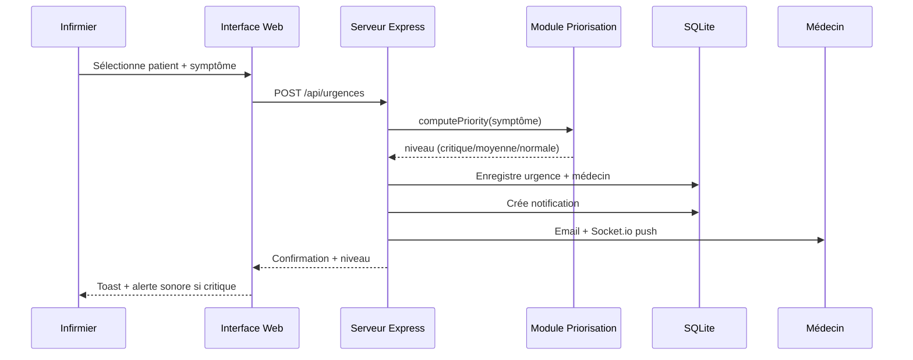
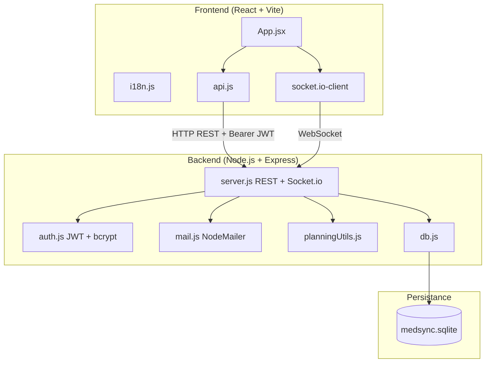

# MedSync Platforme

**Plateforme web intelligente de gestion médicale et coordination des urgences pour une clinique privée**

[](COMPLETION_PERCENTAGE.txt)
[](test-api.mjs)
[](backend/package.json)

MedSync Platforme est une application web full-stack conçue pour moderniser la gestion hospitalière dans une clinique privée algérienne. Elle centralise les données médicales, automatise la priorisation des urgences, envoie des alertes en temps réel et offre des tableaux de bord interactifs adaptés à chaque acteur du personnel de santé.

Ce dépôt constitue la **réalisation technique complète** du projet académique documenté dans `memoire.pdf` et spécifié dans `cahierdecharge.pdf` (Université Saad Dahlab – Blida 1, Licence Informatique, 2025/2026).

---

## Table des matières

1. [Contexte et objectifs](#contexte-et-objectifs)
2. [Problématique résolue](#problématique-résolue)
3. [Fonctionnalités principales](#fonctionnalités-principales)
4. [Acteurs et rôles](#acteurs-et-rôles)
5. [Système d'urgence intelligent](#système-durgence-intelligent)
6. [Architecture technique](#architecture-technique)
7. [Structure du dépôt](#structure-du-dépôt)
8. [Base de données](#base-de-données)
9. [API REST](#api-rest)
10. [Authentification et sécurité](#authentification-et-sécurité)
11. [Temps réel (Socket.io)](#temps-réel-socketio)
12. [Interface utilisateur](#interface-utilisateur)
13. [Prérequis](#prérequis)
14. [Installation](#installation)
15. [Lancement du projet](#lancement-du-projet)
16. [Comptes de démonstration](#comptes-de-démonstration)
17. [Tests automatisés](#tests-automatisés)
18. [Documentation du projet](#documentation-du-projet)
19. [Variables d'environnement](#variables-denvironnement)
20. [État d'avancement](#état-davancement)
21. [Perspectives futures](#perspectives-futures)
22. [Contributeurs académiques](#contributeurs-académiques)
23. [Licence](#licence)

---

## Contexte et objectifs

Le secteur de la santé en Algérie évolue vers la digitalisation des services hospitaliers. Cependant, de nombreuses cliniques rencontrent encore des difficultés dans :

- la gestion des urgences médicales ;
- la coordination entre médecins, infirmiers et administration ;
- l'organisation des plannings et rendez-vous ;
- la circulation lente des informations médicales.

**MedSync Platforme** répond à la problématique :

> *Comment développer une plateforme web permettant d'améliorer la gestion médicale et la coordination des urgences dans une clinique privée moderne ?*

### Objectifs spécifiques atteints

| Objectif | Statut |
|----------|--------|
| Centraliser les informations médicales | ✅ |
| Améliorer la gestion des urgences | ✅ |
| Automatiser les notifications médicales | ✅ |
| Faciliter la coordination entre acteurs | ✅ |
| Organiser les plannings du personnel | ✅ |
| Assurer un suivi efficace des patients | ✅ |
| Proposer une interface moderne et professionnelle | ✅ |

---

## Problématique résolue

MedSync remplace les processus manuels (papier, appels, tableaux physiques) par un système numérique intégré où :

1. Un **infirmier** déclare une urgence en quelques clics.
2. Le **système** calcule automatiquement la priorité (critique / moyenne / normale).
3. Un **médecin disponible** est affecté et notifié instantanément (Socket.io + email).
4. L'**administrateur** supervise l'ensemble via un dashboard statistique.
5. La **secrétaire médicale** gère patients, rendez-vous et plannings.

---

## Fonctionnalités principales

### Tableau de bord premium

- Cartes statistiques : utilisateurs, patients, urgences, urgences critiques, médecins disponibles, salles libres.
- Graphique camembert (Recharts) : répartition des urgences par niveau.
- Graphique barres : activité médicale.
- Fil d'activité récente des urgences.
- Thème visuel distinct par rôle (6 palettes couleur).

### Gestion des utilisateurs (Administrateur)

Module complet conforme au `prompt.txt` :

| # | Fonctionnalité |
|---|----------------|
| 1 | Créer utilisateur |
| 2 | Modifier utilisateur |
| 3 | Supprimer utilisateur |
| 4 | Désactiver / activer compte |
| 5 | Réinitialiser mot de passe |
| 6 | Recherche par nom / email |
| 7 | Filtre par rôle |
| 8 | Filtre actif / inactif |
| 9 | Voir détails utilisateur |
| 10 | Voir dernière connexion |
| 11 | Gérer permissions granulaires |
| 12 | Changer rôle utilisateur |

### Gestion des patients

- Liste complète avec allergies, groupe sanguin, historique.
- Ajout, modification, suppression (selon rôle).
- **Historique médical unifié** : rapports, consultations, urgences, opérations.

### Système d'urgences

- Déclaration par infirmier ou administrateur.
- Priorisation automatique par mots-clés symptômes.
- Affectation automatique d'un médecin disponible.
- Notifications temps réel + email + toast + son (urgences critiques).
- Changement de statut (En attente → Traité).

### Consultations / rendez-vous

- Planification par la secrétaire médicale.
- Notification au médecin concerné.
- Suivi du statut (Planifiée → Terminée).

### Planning médical intelligent

- Créneaux par médecin, date et horaire.
- Détection de conflits (doublon exact + chevauchement horaire).
- Vue calendrier en grille.
- Suppression par l'administrateur.

### Rapports médicaux

- Création par médecin, spécialiste ou chirurgien.
- Diagnostic, traitement, recommandations.
- Export du rapport en fichier texte.

### Gestion des salles

- Salles consultation, bloc opératoire, urgence.
- Statuts libre / occupée avec basculement.
- **Réservations** de salles liées aux patients.

### Opérations chirurgicales

- Programmation d'interventions par le chirurgien.
- Liaison patient + salle de bloc + date.
- Suivi du statut (programmée → terminée).

### Notifications

- Centre de notifications par utilisateur.
- Cloche avec badge compteur non-lus.
- Marquage lu / non-lu.
- Push instantané via Socket.io.

### Internationalisation

- Interface bilingue **Français / English** (toggle global).

---

## Acteurs et rôles

Le système implémente **6 rôles** avec navigation et permissions distinctes :

| Rôle | Modules accessibles |
|------|---------------------|
| **Administrateur** | Tous (supervision complète) |
| **Médecin généraliste** | Dashboard, Urgences, Patients, Consultations, Notifications, Planning, Rapports |
| **Spécialiste** | Dashboard, Urgences, Patients, Consultations, Notifications, Rapports |
| **Chirurgien** | Dashboard, Urgences, Patients, Notifications, Salles, Opérations |
| **Infirmier** | Dashboard, Urgences (création), Patients, Notifications |
| **Secrétaire médicale** | Dashboard, Patients, Consultations, Planning, Notifications, Salles |

Chaque rôle dispose d'un **thème couleur** propre dans l'interface (sidebar, boutons, badges).

---

## Système d'urgence intelligent

Flux automatique conforme au diagramme de séquence UML du mémoire :



### Règles de priorisation

| Symptômes détectés | Niveau | Couleur UI |
|--------------------|--------|------------|
| Douleur thoracique, respiratoire, cardiaque | **critique** | Rouge |
| Fièvre, saignement | **moyenne** | Orange |
| Autres symptômes | **normale** | Vert |

---

## Architecture technique



### Stack technologique

#### Frontend

| Technologie | Usage |
|-------------|-------|
| **React 19** | Interface utilisateur composants |
| **Vite 8** | Build tool, HMR, production bundle |
| **Framer Motion** | Animations login, modales, cartes, transitions |
| **Recharts** | Graphiques camembert et barres |
| **Socket.io Client** | Notifications temps réel |
| **CSS custom premium** | Glassmorphism, thèmes par rôle, responsive |

#### Backend

| Technologie | Usage |
|-------------|-------|
| **Node.js** | Runtime serveur |
| **Express 5** | API REST, middlewares |
| **SQLite3** | Base de données relationnelle locale |
| **jsonwebtoken** | Authentification JWT (24h) |
| **bcryptjs** | Hashage sécurisé des mots de passe |
| **Socket.io** | Push notifications instantanées |
| **Nodemailer** | Alertes email urgences (Ethereal en dev) |
| **Morgan** | Logging HTTP |
| **CORS** | Communication frontend ↔ backend |

> **Note :** Le cahier des charges mentionne MySQL et Tailwind CSS. Le projet utilise **SQLite** (schéma relationnel équivalent, zéro configuration) et **CSS custom** (design glassmorphism premium conforme au cahier visuel).

---

## Structure du dépôt

```text
GESTION_URGENCE_medicale/
│
├── backend/                        # Serveur API Node.js
│   ├── src/
│   │   ├── server.js               # Point d'entrée : Express + Socket.io + routes
│   │   ├── db.js                   # Schéma SQLite, migrations, données seed
│   │   ├── auth.js                 # JWT, bcrypt, middleware rôles
│   │   ├── mail.js                 # Envoi emails (NodeMailer)
│   │   └── planningUtils.js        # Détection conflits / chevauchements
│   ├── medsync.sqlite              # Base de données (générée au 1er lancement)
│   └── package.json
│
├── frontend/                       # Application React (Vite)
│   ├── public/                     # Assets statiques (favicon)
│   ├── src/
│   │   ├── App.jsx                 # Application principale (tous les modules)
│   │   ├── App.css                 # Styles glassmorphism + thèmes rôles
│   │   ├── api.js                  # Client HTTP + gestion token JWT
│   │   ├── i18n.js                 # Traductions FR/EN, rôles, modules
│   │   ├── main.jsx                # Point d'entrée React
│   │   └── index.css               # Reset CSS global
│   ├── index.html
│   ├── vite.config.js
│   ├── eslint.config.js
│   └── package.json
│
├── cahierdecharge.pdf              # Cahier des charges expert (spécifications)
├── memoire.pdf                     # Mémoire de licence (conception UML, contexte)
├── prompt.txt                      # Spécifications module Admin Utilisateurs
│
├── CHECKLIST.txt                   # Audit détaillé fonctionnalités OK/KO
├── COMPLETION_PERCENTAGE.txt       # Taux de complétion par module (93%)
├── RAPPORT_FINAL.txt               # Rapport final de conformité
├── test-api.mjs                    # Suite de tests API (30 tests)
├── runningall.bat                  # Lance backend + frontend (Windows)
└── README.md                       # Ce fichier
```

---

## Base de données

Fichier : `backend/medsync.sqlite` (créé automatiquement au premier démarrage).

### Schéma relationnel (10 tables)

| Table | Description | Clés |
|-------|-------------|------|
| `users` | Comptes utilisateurs (nom, email, password hashé, rôle, téléphone, actif) | PK: id |
| `permissions` | Permissions granulaires par utilisateur | FK: user_id |
| `patients` | Dossiers patients (nom, âge, groupe sanguin, allergies, historique) | PK: id |
| `urgences` | Cas d'urgence (patient, niveau, symptôme, statut, médecin assigné) | FK: patient_id, medecin_id |
| `plannings` | Créneaux horaires des médecins | FK: medecin_id |
| `consultations` | Rendez-vous / consultations planifiées | FK: patient_id, medecin_id |
| `rapports` | Rapports médicaux (diagnostic, traitement, recommandations) | FK: medecin_id, patient_id |
| `salles` | Salles médicales (consultation, bloc, urgence) | PK: id |
| `reservations_salles` | Réservations de salles | FK: salle_id, patient_id, medecin_id |
| `operations` | Opérations chirurgicales programmées | FK: patient_id, chirurgien_id, salle_id |
| `notifications` | Alertes utilisateurs (urgence, système, consultation) | FK: utilisateur_id |

### Données de démonstration (seed)

Au premier lancement, la base est pré-remplie avec :

- 6 comptes utilisateurs (un par rôle)
- 2 patients exemple
- 2 urgences exemple
- Plannings, rapports, salles, consultations, opérations

---

## API REST

**Base URL :** `http://localhost:4000/api`

**Authentification :** Header `Authorization: Bearer <JWT_TOKEN>` (sauf `/health` et `/auth/login`).

### Routes publiques

| Méthode | Route | Description |
|---------|-------|-------------|
| GET | `/health` | Santé du serveur + flag temps réel |
| POST | `/auth/login` | Connexion → retourne `{ token, user }` |

### Routes protégées (extrait)

| Méthode | Route | Rôles autorisés | Description |
|---------|-------|-----------------|-------------|
| GET | `/users` | administrateur | Liste utilisateurs + filtres |
| POST | `/users` | administrateur | Créer utilisateur |
| PUT | `/users/:id` | administrateur | Modifier utilisateur |
| DELETE | `/users/:id` | administrateur | Supprimer utilisateur |
| PATCH | `/users/:id/toggle` | administrateur | Activer / désactiver |
| PATCH | `/users/:id/reset-password` | administrateur | Reset → `MedSync2026!` |
| GET | `/patients` | tous authentifiés | Liste patients |
| POST | `/patients` | admin, secrétaire | Ajouter patient |
| PUT | `/patients/:id` | admin, secrétaire | Modifier patient |
| DELETE | `/patients/:id` | administrateur | Supprimer patient |
| GET | `/patients/:id/historique` | tous authentifiés | Historique médical complet |
| GET | `/urgences` | tous authentifiés | Liste urgences |
| POST | `/urgences` | admin, infirmier | Créer urgence + priorisation |
| PATCH | `/urgences/:id/statut` | médecins, admin | Changer statut |
| GET | `/plannings` | tous authentifiés | Liste plannings |
| POST | `/plannings` | admin, secrétaire | Ajouter créneau |
| DELETE | `/plannings/:id` | administrateur | Supprimer créneau |
| GET | `/consultations` | tous authentifiés | Liste consultations |
| POST | `/consultations` | admin, secrétaire | Planifier rendez-vous |
| GET | `/rapports` | tous authentifiés | Liste rapports |
| POST | `/rapports` | médecins, admin | Créer rapport |
| GET | `/salles` | tous authentifiés | Liste salles |
| POST | `/salles` | administrateur | Ajouter salle |
| GET | `/reservations` | tous authentifiés | Réservations salles |
| POST | `/reservations` | admin, secrétaire, chirurgien | Réserver salle |
| GET | `/operations` | tous authentifiés | Opérations chirurgicales |
| POST | `/operations` | admin, chirurgien | Programmer opération |
| GET | `/notifications` | tous authentifiés | Notifications utilisateur |
| PATCH | `/notifications/:id/read` | tous authentifiés | Marquer comme lu |
| GET | `/stats` | tous authentifiés | Statistiques dashboard |
| GET | `/roles` | tous authentifiés | Liste des rôles |

---

## Authentification et sécurité

### Flux de connexion

1. L'utilisateur envoie `email` + `password` à `POST /api/auth/login`.
2. Le serveur vérifie le mot de passe (bcrypt ou migration depuis texte clair).
3. Un **JWT** signé (validité 24h) est retourné avec les infos utilisateur.
4. Le frontend stocke le token dans `localStorage` (`medsync_token`).
5. Toutes les requêtes suivantes incluent `Authorization: Bearer <token>`.

### Sécurité implémentée

- Hashage **bcrypt** (10 rounds) pour tous les mots de passe.
- Migration automatique : les anciens mots de passe en clair sont re-hashés à la connexion.
- Middleware JWT sur **toutes** les routes `/api/*` (sauf login et health).
- Middleware `requireRoles()` sur les routes sensibles (403 si rôle insuffisant).
- Comptes inactifs (`actif = 0`) rejetés à la connexion.

### Secret JWT

Par défaut : `medsync-secret-2026`. En production, définir la variable d'environnement `JWT_SECRET`.

---

## Temps réel (Socket.io)

Le backend expose Socket.io sur le même port que l'API (`4000`).

### Événements

| Événement | Direction | Description |
|-----------|-----------|-------------|
| `join` | Client → Serveur | Rejoindre la room `user-{id}` |
| `notification` | Serveur → Client | Nouvelle notification pour l'utilisateur |
| `urgence` | Serveur → Tous | Nouvelle urgence créée (broadcast) |
| `urgence-update` | Serveur → Tous | Statut urgence modifié |

Le frontend se connecte automatiquement après login et affiche toast + son pour les urgences critiques.

---

## Interface utilisateur

### Page de login

- Fond animé avec **particules réactives à la souris**.
- Effet glow / profondeur premium.
- Carte glassmorphism avec bordures lumineuses cyan.
- Citations motivantes rotatives (FR/EN).
- Animation Framer Motion à l'apparition.

### Design system

| Élément | Spécification |
|---------|---------------|
| Fond | Blanc / bleu très clair |
| Accent médical | Cyan `#00b0f4` |
| Cartes | Glass transparent + blur |
| Urgence critique | Rouge `#ef4444` |
| Urgence moyenne | Orange `#f59e0b` |
| Urgence normale | Vert `#22c55e` |
| Effets | Glow, hover animations, transitions fluides |

### Responsive

Layout adaptatif : sidebar + contenu principal, grille dashboard responsive (breakpoint 960px).

---

## Prérequis

| Outil | Version minimale |
|-------|------------------|
| **Node.js** | 18+ recommandé (16+ minimum) |
| **npm** | Inclus avec Node.js |
| **Git** | Pour cloner le dépôt |
| **Navigateur moderne** | Chrome, Firefox, Edge |
| **Windows (optionnel)** | Pour `runningall.bat` |

Outil optionnel : [DB Browser for SQLite](https://sqlitebrowser.org/) pour inspecter `medsync.sqlite`.

---

## Installation

### 1. Cloner le dépôt

```bash
git clone https://github.com/amnamine/medsync-platforme.git
cd GESTION_URGENCE_medicale
```

### 2. Installer le backend

```bash
cd backend
npm install
```

Dépendances installées : `express`, `sqlite3`, `cors`, `morgan`, `bcryptjs`, `jsonwebtoken`, `socket.io`, `nodemailer`.

### 3. Installer le frontend

```bash
cd ../frontend
npm install
```

Dépendances installées : `react`, `react-dom`, `vite`, `framer-motion`, `recharts`, `socket.io-client`.

---

## Lancement du projet

### Option A — Windows (recommandé)

Double-cliquer sur **`runningall.bat`** à la racine du projet.

Cela ouvre deux fenêtres terminal :
- **MedSync Backend** → `http://localhost:4000`
- **MedSync Frontend** → `http://localhost:5173` (ou port Vite alternatif)

### Option B — Manuel (2 terminaux)

**Terminal 1 — Backend :**

```bash
cd backend
npm start
# ou: node src/server.js
```

**Terminal 2 — Frontend :**

```bash
cd frontend
npm run dev
```

Ouvrir l'URL affichée par Vite (généralement `http://localhost:5173`).

### Build production (frontend)

```bash
cd frontend
npm run build
npm run preview
```

---

## Comptes de démonstration

| Email | Mot de passe | Rôle |
|-------|--------------|------|
| `admin@medsync.dz` | `admin123` | Administrateur |
| `medecin@medsync.dz` | `medecin123` | Médecin généraliste |
| `specialiste@medsync.dz` | `spec123` | Spécialiste |
| `chirurgien@medsync.dz` | `chir123` | Chirurgien |
| `infirmier@medsync.dz` | `inf123` | Infirmier |
| `secretaire@medsync.dz` | `sec123` | Secrétaire médicale |

> Après réinitialisation par l'admin, le mot de passe devient **`MedSync2026!`**

---

## Tests automatisés

Une suite de **30 tests API** est disponible à la racine :

```bash
# Démarrer le backend d'abord, puis :
node test-api.mjs
```

Tests couverts :

- Health check + flag realtime
- Login 6 rôles + génération JWT
- Rejet sans token / identifiants invalides
- CRUD utilisateurs, patients, urgences
- Priorisation automatique (critique, moyenne)
- Conflits planning (chevauchement)
- Consultations, opérations, réservations
- Rapports, salles, historique patient

Résultat attendu : **`30 passed, 0 failed`**

Lint frontend :

```bash
cd frontend
npm run lint
```

---

## Documentation du projet

| Fichier | Contenu |
|---------|---------|
| `cahierdecharge.pdf` | Spécifications fonctionnelles, design, technologies, acteurs |
| `memoire.pdf` | Mémoire académique : UML, problématique, architecture, captures |
| `prompt.txt` | Exigences détaillées module Administration Utilisateurs |
| `CHECKLIST.txt` | Audit item par item (OK / PART / KO) |
| `COMPLETION_PERCENTAGE.txt` | Taux de complétion 93% par module |
| `RAPPORT_FINAL.txt` | Rapport de conformité final pour soutenance |

---

## Variables d'environnement

| Variable | Défaut | Description |
|----------|--------|-------------|
| `JWT_SECRET` | `medsync-secret-2026` | Clé secrète signature JWT |
| `SMTP_HOST` | — | Serveur SMTP production |
| `SMTP_PORT` | `587` | Port SMTP |
| `SMTP_USER` | — | Utilisateur SMTP |
| `SMTP_PASS` | — | Mot de passe SMTP |

Sans configuration SMTP, NodeMailer utilise un compte **Ethereal** de test (emails loggés en console avec URL de preview).

---

## État d'avancement

**Complétion globale : 93%** (voir `COMPLETION_PERCENTAGE.txt`)

| Module | Complétion |
|--------|------------|
| Gestion Utilisateurs | 100% |
| Gestion Patients | 100% |
| Consultations | 100% |
| Opérations Chirurgien | 100% |
| Rôles & Accès | 100% |
| Système Urgence | 98% |
| Notifications | 95% |
| Dashboard | 95% |
| Salles | 95% |
| Authentification | 95% |
| Planning | 90% |
| Rapports | 90% |
| Design UX | 88% |
| Technologies | 85% |

**Verdict :** Projet prêt pour démonstration et soutenance.

---

## Perspectives futures

Améliorations optionnelles mentionnées dans le mémoire :

- Migration SQLite → **MySQL** pour déploiement production.
- Export **PDF natif** des rapports médicaux.
- **Application mobile** (React Native).
- **Intelligence artificielle** pour prédiction des urgences.
- **Télémédecine** par visioconférence.
- Intégration **IoT** (objets médicaux connectés).
- **Dockerisation** (Docker Compose frontend + backend).

---

## Contributeurs académiques

| | |
|---|---|
| **Université** | Université Saad Dahlab – Blida 1 |
| **Faculté** | Faculté des Sciences – Département Informatique |
| **Spécialité** | Ingénierie des Systèmes d'Information et du Logiciel |
| **Promoteur** | Mme Berramdane Djamila |
| **Réalisé par** | Djenadi Zohra & Behloul Yasmine |
| **Année** | 2025/2026 |
| **Sujet** | Conception et développement d'une plateforme web intelligente de gestion médicale et coordination des urgences pour une clinique privée |

---

## Licence

Projet académique réalisé dans le cadre d'un mémoire de licence. Tous droits réservés aux auteurs et à l'Université Saad Dahlab – Blida 1.

Pour toute utilisation, redistribution ou modification commerciale, se référer aux contraintes du mémoire et contacter les auteurs.

---

<p align="center">
  <strong>MedSync Platforme</strong><br>
  <em>Every second matters. Smart coordination saves lives.</em><br>
  <em>Chaque seconde compte. La coordination intelligente sauve des vies.</em>
</p>
